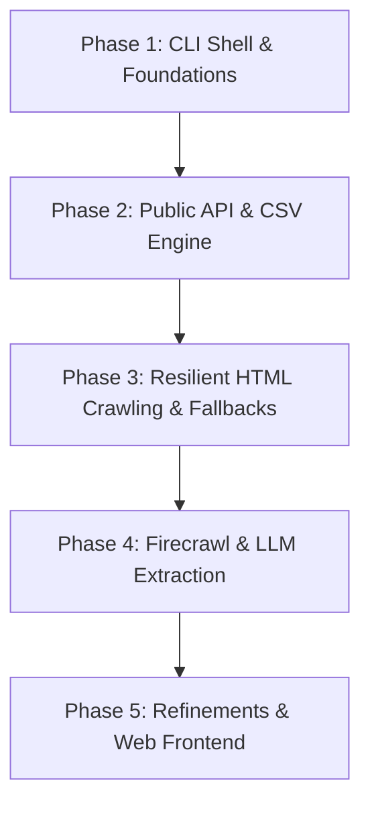

# Project Context: Job Agent

## Problem Statement
Job hunting across multiple platforms is a tedious, manual task. Job seekers must navigate different search interfaces, deal with varying filters, and manually track listings across multiple boards like Naukri (India's largest job portal), RemoteOK (a major remote job directory), and Wellfound (startup-focused job board).

Furthermore, programmatically aggregating this data is challenging because:
1. **Naukri** uses Akamai Bot Manager, blocking automated requests with `406 Recaptcha Required`.
2. **Wellfound** employs Cloudflare and DataDome protection, blocking standard scraper requests with `403 Forbidden`.
3. **Data Formatting** is inconsistent across these platforms, making manual comparison time-consuming.

## Solution: The Job Agent
We are building a Python-based **Job Agent** that solves these problems by providing:
1. **Aggregated Search:** A single CLI entrypoint to search for jobs by title/keyword across Naukri, RemoteOK, and Wellfound.
2. **Resilient Data Aggregation:** 
   * **RemoteOK:** Uses the official public API to fetch live remote job listings.
   * **Naukri:** Uses HTML scraping (via requests/BeautifulSoup with fallback simulator to bypass Akamai bot detection).
   * **Wellfound:** Uses Firecrawl (Mendable.ai's scraping/crawling API) to bypass DataDome and extract startup job details, with a simulated fallback if no API key is provided.
3. **Consolidated Output:** Normalizes data fields and saves them directly to a `jobs_export.csv` file in the workspace directory.
4. **Premium Console UI:** Leverages the Python `rich` library to render loading indicators, status panels, and a tabular summary of the results.

## Phase-Wise Architecture

To ensure a structured and reliable implementation, the project is structured into the following phase-wise architecture:

### Phase 1: CLI Shell & Foundations (Completed)
* **Goal:** Create a robust environment shell and premium terminal layout.
* **Deliverables:**
  * Configure system output/stderr formatting to force UTF-8 (preventing encoding failures on Windows terminals).
  * Design the command-line dashboard using the `rich` library (loaders, tables, panels).
  * Define standardized job listing schema models across all targets.

### Phase 2: Public API & CSV Engine (Completed)
* **Goal:** Integrate open targets and establish data export pipelines.
* **Deliverables:**
  * Query the **RemoteOK public API** using stealth Chrome headers to avoid standard HTTP client bans.
  * Build a smart multi-word keyword filter matching search terms across job titles, tags, and descriptions.
  * Implement the CSV export engine writing normalized datasets to `jobs_export.csv`.

### Phase 3: Resilient HTML Crawling & Fallbacks (Completed)
* **Goal:** Scraping complex sites and implementing fail-safe layers.
* **Deliverables:**
  * Perform HTML scraping on **Naukri** search query landing pages using `BeautifulSoup`.
  * Set up `curl_cffi` browser impersonators mimicking Chrome TLS/HTTP2 fingerprints.
  * Build a high-fidelity mock generator fallback layer to keep the CLI operational with relevant results if Akamai/DataDome blocks connection requests.

### Phase 4: Advanced Scraper Integrations (Completed)
* **Goal:** Bypassing Cloudflare/DataDome blocks using specialized web crawling platforms.
* **Deliverables:**
  * Integrate Mendable's **Firecrawl API** to crawl Wellfound startup roles.
  * Define a structured LLM extraction schema (`jobs` array with `title`, `company`, `location`, `salary`) to let Firecrawl clean raw pages automatically.
  * Add support for API keys mapped to local environment configuration (`FIRECRAWL_API_KEY`).

### Phase 5: Production Refinement & Web Interface (Planned)
* **Goal:** Scale aggregation and design a visual UI.
* **Deliverables:**
  * Integrate automatic proxy rotation (residential/datacenter proxies) for direct HTML scraping.
  * Port the CLI tool to a lightweight web dashboard (e.g. Streamlit or FastAPI with a Vanilla CSS frontend).
  * Enable cron scheduling to run searches daily/weekly and push notifications to Slack or email.
